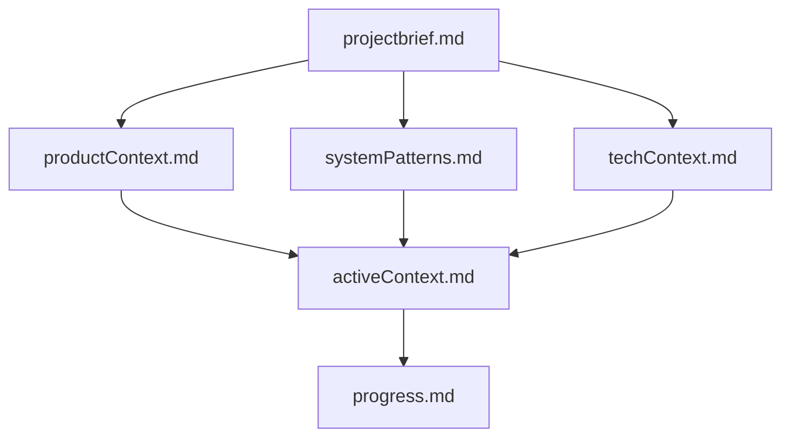

# 1. メモリバンク構造（`.cline/memory/`）

| ファイル | 役割 | 作成タイミング |
| --- | --- | --- |
| **projectbrief.md** | 目的・ゴール・スコープ | プロジェクト開始時（必須） |
| **productContext.md** | 問題・ユーザー体験・価値 | 〃 |
| **systemPatterns.md** | アーキテクチャ・設計原則 | 〃 |
| **techContext.md** | 技術選定・環境・依存 | 〃 |
| **activeContext.md** | 現在の焦点・決定事項 | 変更の都度 |
| **progress.md** | 実装状況・既知の課題 | デイリー |

> **ルール** : 新しい知見・変更があれば即座に該当ファイルを更新。`update memory` 要求時は **必ず全ファイル確認**。

追加ドキュメント（API 仕様・テスト戦略など）は自由にサブフォルダを作成する。
