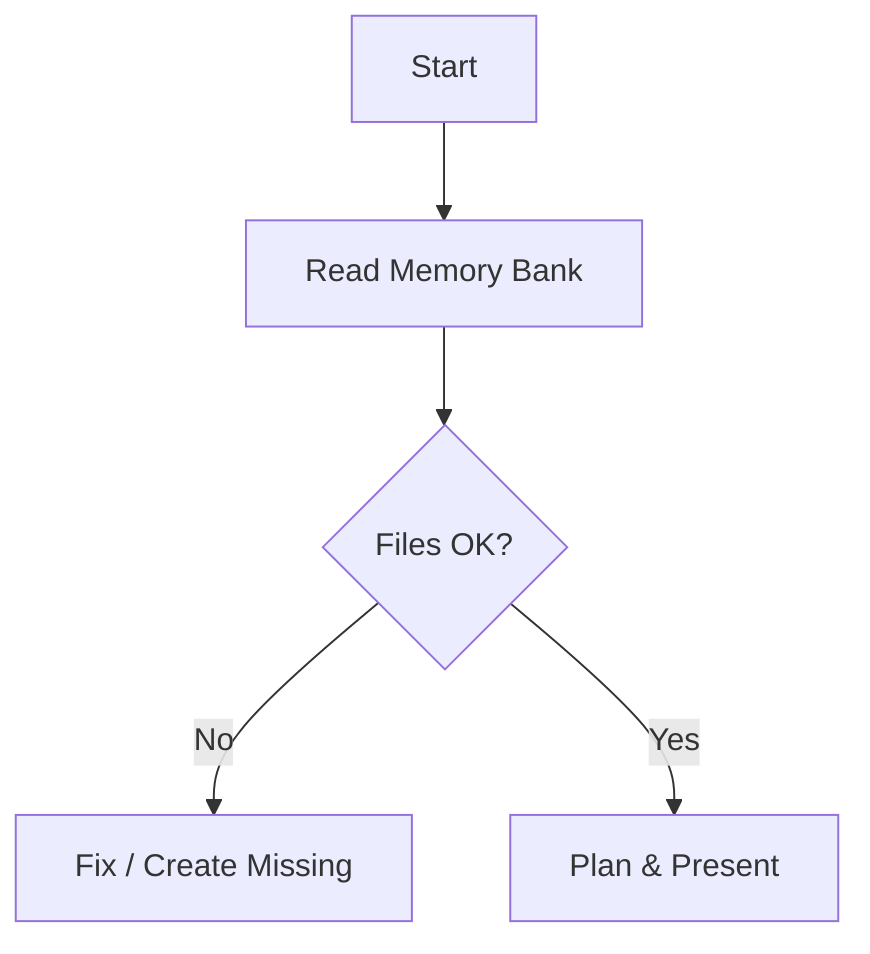
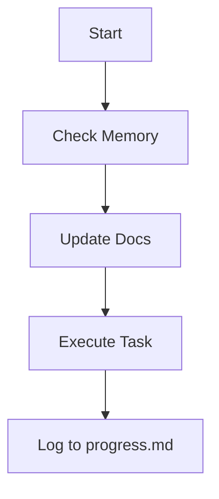

# 2. コアワークフロー

## 計画モード

```mermaid
flowchart TD
    S[Start] --> R[Read Memory Bank]
    R --> C{Files OK?}
    C -- No --> F[Fix / Create Missing]
    C -- Yes --> P[Plan & Present]
```

## 実行モード

```mermaid
flowchart TD
    S[Start] --> C[Check Memory]
    C --> U[Update Docs]
    U --> X[Execute Task]
    X --> L[Log to progress.md]
```

