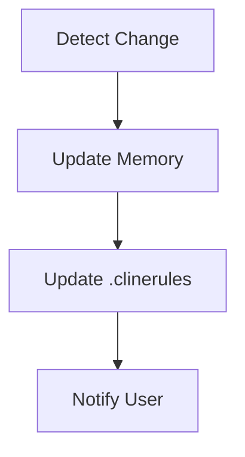

# 6. ドキュメント更新フロー

1. 重要設計・実装変更が発生
2. 対応するメモリファイルを即更新
3. `.clinerules` に新パターンがあれば追記

```mermaid
flowchart TD
    A[Detect Change] --> B[Update Memory]
    B --> C[Update .clinerules]
    C --> D[Notify User]
```

